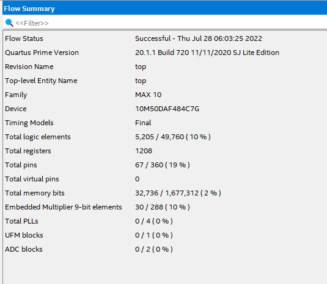

# Projeto 2 - CPU RISC-V que implementa o conjunto de instruções RV32IM:              
         
# 1 - Sobre esse Projeto:        
 - Cria um microprocessador RISC-V de 32 bits.      
 - **Memórias**:     
	- **RAM** (_Data Memory_):     
		- Total: **16 KiB**.      
		- **Endereços** de memória de **13 bits**.      
	- **ROM** (_Program Memory_):     
		- Total: **64 KiB**.      
		- **Endereços** de memória de **16 bits**.      
	

## 1.1 - Arquivos do Projeto e Módulos Especificados dentro de cada um:       
 - Arquivo **`modulos_basicos.sv`**: Módulos de uso geral, não específicos da CPU RISC-V.        
	- Módulo **`ff_rst`**: _Flip-Flop_ com _RESET_.      
	- Módulo **`ff_rst_en`**: _Flip-Flop_ com _RESET_ e _ENABLE_.      
	- Módulo **`mux2`**: Multiplexador 2:1.      
	- Módulo **`mux3`**: Multiplexador 3:1.      
	- Módulo **`mux4`**: Multiplexador 4:1.      
	- Módulo **`dig_displ_7_segs`**: Escreve um determinado valor hexadecimal em um display de 7 segmentos.           
	- Módulo **`logical_oper_alu`**: Resultado das operações lógicas `and`, `or` e `xor`.      
	- Módulo **`adder`**: Somador simples.      
	- Módulo **`adder2`**: Somador completo.      
	- Módulo **`multiply`**: Multiplicação e resultado das operações `mulh`, `mulhsu` e `mulhu`.      
	- Módulo **`divide_remainder`**: Divisão e resto da divisão; números inteiros sinalizados e não-sinalizados.            
	- Módulo **`shift_right_arithmetic`**: Deslocamento aritmético para a direita.      
	- Módulo **`logical_shift_opers`**: Deslocamento lógico para esquerda e direita.      
	- Módulo **`set_less_than`**: Operação _Set Less Than_.      
 - Arquivo **`imem_rf_dmem.v`**: Módulos referentes às memórias da CPU RISC-V.     
	- Módulo **`reg_file`**: _Register File_ com 32 registradores.      
	- Módulo **`instr_mem`**: Memória ROM para armazenar os programas. Utiliza os blocos de memória M9K.      
	- Módulo **`data_mem_single`**: Memória RAM para armazenamento de dados. Utiliza os blocos de memória M9K.     
 - Arquivo **`alu.sv`**: Contém a ALU (_Arithmetic Logic Unit_) da CPU.    
	- Módulo **`output_flags_alu`**: Módulo para retornar os _output flags_ das operações da ALU.      
	- Módulo **`alu`**: ALU implementada na CPU RISC-V.          
 - Arquivo **`modulos_auxiliares_cpu.sv`**: Módulos cuja implementação é específica para a CPU RISC-V desenvolvida nesse projeto.        
	- Módulo **`instr_fields`**: Decodifica os campos da instrução de 32 bits da ISA RISC-V.      
	- Módulo **`extend`**: Preenche o campo referente ao "Valor Imediato" (_Immediate_) da instrução.      
	- Módulo **`take_branch`**: Indica se a instrução é do tipo _branch_ e se a condição do _branch_ é verdadeira ou falsa.      
	- Módulo **`main_dec`**: Decodificador principal das instruções.      
	- Módulo **`alu_dec`**: Decodificador que le os campos da instrução e retorna o código da instrução na ALU.      
 - Arquivo **`top.sv`**: Arquivo com o módulo principal do projeto.     
	- Módulo **`controller`**: Módulo que contém o decodificador das instruções da CPU.      
	- Módulo **`datapath`**: Módulo referente ao bloco _Data Path_ da CPU.    
	- Módulo **`riscv_single`**: Camada superior de uma CPU RISC_V do tipo _single-cycle_.      
	- Módulo **`top`**: Módulo principal do projeto.      
 - Arquivo **`testbench.sv`**: Arquivo com o _testbench_ do módulo `top`.     
	- Módulo **`testbench`**: Módulo com o _testbench_ do módulo `top`.      
       

## 1.2 - Recursos do kit FPGA DE10-Lite usados pelo projeto:       
        
         
 - Os dados apresentados aqui foram tirados do **_Compilation Report_** do projeto:        
 - Recursos utilizados do CI FPGA **10M50DAF484C7G**:       
	- Elementos Lógicos: **5214**.      
	- Registradores: **1211**.     
	- Pinos: **67**.     
	- Bits dos blocos de memória **M9K**: **262,112** bits.   
	- _Embedded Multiplier 9-bit elements_: **30**.       
	 
---       
         


# 2 - Código em SystemVerilog do _testbench_:        
       
```verilog      
          
``timescale 1 ps / 1 ps

module testbench();
	// Constantes
	parameter ROM_REG_ADDR = 10; // 1024 bytes de memoria ROM
	parameter RAM_REG_ADDR = 10; // 1024 bytes de memoria RAM
	
	// Sinais e arrays usados aqui
	logic        clk;
	logic        reset; 
	logic        MemWrite;
	logic [31:0] WriteData;
	logic [31:0] DataAdr;
	
	// --> Instancia do modulo principal do projeto
	top #( .DATA_WIDTH(32), .ADDR_W_ROM(15), .ADDR_W_RAM(13), .HEX_FILE("riscvtest.txt")  ) dut
	     ( .clk( clk ), 
		 .reset( reset ), 
		 .mem_write( MemWrite ),
		 .write_data( WriteData ), 
		 .data_addr( DataAdr ) );
	// Inicializacao dos testes
	initial begin
		reset <= 1; 
		#22; 
		reset <= 0;
	end
	
	
	// Geracao dos pulsos de clock usados nos testes sequenciais
	always begin
		clk <= 1; 
		#5; 
		clk <= 0; 
		#5;
	end
	
	// --> Variavel do tipo numero inteiro para mostra a iteracao atual
	integer i = 0;
	
	// --> Verificacao dos resultados
	always @( negedge clk ) begin
		$monitor("i=%d, MemWrite=%d, WriteData=%d, DataAdr=%d\n", i, MemWrite, WriteData, DataAdr);
		#5;
		i = i + 1;
		#5;
		
		if( MemWrite ) begin
			if( (DataAdr === 100) & (WriteData === 25) ) begin
				$display("Simulation succeeded");
				$stop;
			end 
			else if( DataAdr !== 96 ) begin
				$display("Simulation failed");
				$stop;
			end
		end
	end
endmodule
```       
              
---       
         


# 3 - Simulação no ModelSim:        
        

## 3.1 - Arquivos com a simulação no ModelSim         
 - Nome do projeto: **`Simulacao_MS.mpf`**.     
 - Pasta com os arquivosd a simulação: **`work`**.       
 - Arquivo onde os resultados da simulação no ModelSim foram salvos: **`./Documentacao_Resultados/WaveformSimulacao.vcd`**
 - Arquivos usados na simulação (e ordem de compilação):       
	- **0** - **`altera_mf.v`**: Biblioteca da Intel/Altera para poder usar a memória RAM na simulação.      
	- **1** - **`modulos_basicos.sv`**.      
	- **2** - **`imem_rf_dmem.v`**.      
	- **3** - **`modulos_auxiliares_cpu.sv`**.      
	- **4** - **`alu.sv`**.      
	- **5** - **`top.sv`**.      
	- **6** - **`testbench.sv`**.      
        
---       
         


## 3.2 - Resultados da simulação no ModelSim:      
           

### 3.2.1- Comando TCL da Simulação Realizada no ModelSim:       
         
```tcl      
        
##########################
# Executar a simulação   #
##########################
VSIM> run 200


###############################
#  Resultado da simulação     #
###############################
# Simulation succeeded
# ** Note: $stop    : C:/Users/Eduardo/Desktop/Especializacao_SENAI/PosGrad_Senai_SistEmbarc/M13_Monografia/Repo_TCC_SistEmb/Proj_RV32IM_02_De10Lite/testbench.sv(60)
#    Time: 195 ps  Iteration: 0  Instance: /testbench
# Break in Module testbench at C:/Users/Eduardo/Desktop/Especializacao_SENAI/PosGrad_Senai_SistEmbarc/M13_Monografia/Repo_TCC_SistEmb/Proj_RV32IM_02_De10Lite/testbench.sv line 60
```     
         
---       
         


### 3.2.2 - Gráfico do ModelSim com o _Waveform_ da Simulação        
        
         
---       
         


### 3.2.3 - Gráfico do GtkWave com o _Waveform_ da Simulação        
        
         
---       
         

