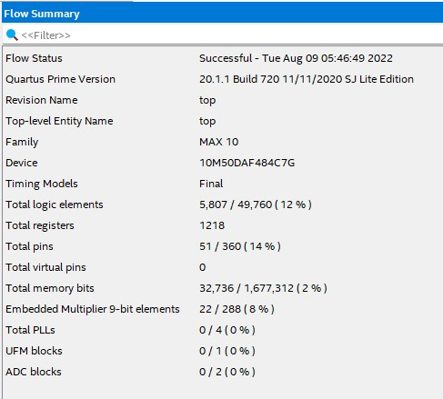
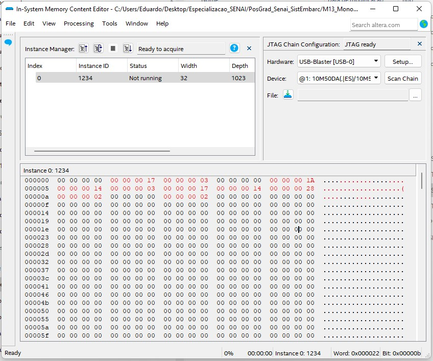

# Projeto 3 - CPU RISC-V que implementa o conjunto de instruções RV32IM e carrega no kit FPGA:              
         
# 1 - Sobre esse Projeto:        
 - Cria um microprocessador RISC-V de 32 bits.      
 - **Memórias**:     
	- **RAM** (_Data Memory_):     
		- Total: **16 KiB**.      
		- **Endereços** de memória de **13 bits**.      
	- **ROM** (_Program Memory_):     
		- Total: **64 KiB**.      
		- **Endereços** de memória de **16 bits**.      
	

## 1.1 - Arquivos do Projeto e Módulos Especificados dentro de cada um:       
 - Arquivo **`modulos_basicos.sv`**: Módulos de uso geral, não específicos da CPU RISC-V.        
	- Módulo **`ff_rst`**: _Flip-Flop_ com _RESET_.      
	- Módulo **`ff_rst_en`**: _Flip-Flop_ com _RESET_ e _ENABLE_.      
	- Módulo **`mux2`**: Multiplexador 2:1.      
	- Módulo **`mux3`**: Multiplexador 3:1.      
	- Módulo **`mux4`**: Multiplexador 4:1.      
	- Módulo **`dig_displ_7_segs`**: Escreve um determinado valor hexadecimal em um display de 7 segmentos.           
	- Módulo **`logical_oper_alu`**: Resultado das operações lógicas `and`, `or` e `xor`.      
	- Módulo **`adder`**: Somador simples.      
	- Módulo **`adder2`**: Somador completo.      
	- Módulo **`multiply`**: Multiplicação e resultado das operações `mulh`, `mulhsu` e `mulhu`.      
	- Módulo **`divide_remainder`**: Divisão e resto da divisão; números inteiros sinalizados e não-sinalizados.            
	- Módulo **`shift_right_arithmetic`**: Deslocamento aritmético para a direita.      
	- Módulo **`logical_shift_opers`**: Deslocamento lógico para esquerda e direita.      
	- Módulo **`set_less_than`**: Operação _Set Less Than_.      
 - Arquivo **`imem_rf_dmem.v`**: Módulos referentes às memórias da CPU RISC-V.     
	- Módulo **`reg_file`**: _Register File_ com 32 registradores.      
	- Módulo **`instr_mem`**: Memória ROM para armazenar os programas. Utiliza os blocos de memória M9K.      
	- Módulo **`data_mem_single`**: Memória RAM para armazenamento de dados. Utiliza os blocos de memória M9K.     
 - Arquivo **`alu.sv`**: Contém a ALU (_Arithmetic Logic Unit_) da CPU.    
	- Módulo **`output_flags_alu`**: Módulo para retornar os _output flags_ das operações da ALU.      
	- Módulo **`alu`**: ALU implementada na CPU RISC-V.          
 - Arquivo **`modulos_auxiliares_cpu.sv`**: Módulos cuja implementação é específica para a CPU RISC-V desenvolvida nesse projeto.        
	- Módulo **`instr_fields`**: Decodifica os campos da instrução de 32 bits da ISA RISC-V.      
	- Módulo **`extend`**: Preenche o campo referente ao "Valor Imediato" (_Immediate_) da instrução.      
	- Módulo **`take_branch`**: Indica se a instrução é do tipo _branch_ e se a condição do _branch_ é verdadeira ou falsa.      
	- Módulo **`main_dec`**: Decodificador principal das instruções.      
	- Módulo **`alu_dec`**: Decodificador que le os campos da instrução e retorna o código da instrução na ALU.      
 - Arquivo **`top.sv`**: .     
	- Módulo **`controller`**: Módulo que contém o decodificador das instruções da CPU.      
	- Módulo **`datapath`**: Módulo referente ao bloco _Data Path_ da CPU.    
	- Módulo **`riscv_single`**: Camada superior de uma CPU RISC_V do tipo _single-cycle_.      
	- Módulo **`main_module`**: Módulo criado dentro do módulo `top`.  
	- Módulo **`top`**: Módulo principal do projeto.      
       

## 1.2 - Recursos do kit FPGA DE10-Lite usados pelo projeto:     
| Teste 1 | Teste 2 |      
| :---: | :---: |
|  |  |
           
 - Os dados apresentados aqui foram tirados do **_Compilation Report_** do projeto:        
 - Recursos utilizados do CI FPGA **10M50DAF484C7G**:       
	- Elementos Lógicos: **5649**.      
	- Registradores: **1233**.     
	- Pinos: **41**.     
	- Bits dos blocos de memória **M9K**: **524256** bits.   
	- _Embedded Multiplier 9-bit elements_: **30**.       
	 
---       
         


# 2 - Scripts em Assembly RISC-V com os testes realizados com a CPU criada no projeto:        
 - Os scripts em Assembly RISC-V são compilados usando o compilador e simulador RISC-V RARS.        
       


# 2.1 - Teste 1: Script `Script_teste_01.s`        
| Resultado no Kit DE10-Lite | _In System Memory_ |      
| :---: | :---: |
|  |  |
           
 - Script no **arquivo `Script_teste_01.s`**:       
        
```asm     
        
#; Inicio
addi x1, x0, 4        #; x1 = 0 + 4
addi x2, x0, 0        #; x2 = 0 + 0
addi x3, x0, 10       #; x3 = 0 + 10
addi x4, x0, 1        #; x13 = 0 + 1
addi x5, x0, 0
#; Bloco 'loop'
loop: 
add x2, x2, x4       #; x14 = x13 + x14 
addi x4, x4, 1       #; x4 = x4 + 1
sub x5, x3, x4       #; x5 = x3 - x4
beq x5, x0, label2
beq x4, x4, loop     #; Se x4 < x3, voltar 2 linhas
#; Linhas executadas após a última execução do bloco 'loop'
label2:
add x6, x0, x2       #; x6 = x2
addi x7, x0, 0
addi x7, x6, -44     #; x16 = x15 - 44
#; Salvar os dados na memoria
sw   x1, 0(x1)       #; A - MEM[4 + 0] = 0
lw  x10, 0(x1)
sw   x2, 4(x1)       #; B - MEM[4 + 4] = 45 (0x2D)
lw  x10, 4(x1)
sw   x3, 8(x1)       #; C - MEM[4 + 8] = 10 (0x0A)
lw  x10, 8(x1)
sw   x4, 12(x1)      #; D - MEM[4 + 12] = 10 (0x0A)
lw  x10, 12(x1)
sw   x5, 16(x1)      #; E - MEM[4 + 16] = 0
lw  x10, 16(x1)
sw   x6, 20(x1)      #; F - MEM[4 + 20] = 45 (0x2D)
lw  x10, 20(x1)
sw   x7, 24(x1)      #; G - MEM[4 + 24] = 1 (0x01)
lw  x10, 24(x1)
#; Bloco 'end'
end: beq  x0, x0, end     #; Encerra o programa
```      
       
---       
         


# 2.2 - Teste 2: Script `Script_teste_02.s`        
| Resultado no Kit DE10-Lite | _In System Memory_ |      
| :---: | :---: |
|  |  |
           
 - Script no **arquivo `riscvtest_03B_script3B.s`**:       
        
```asm     
         
#; Registradores com os valores usados nas operacoes
addi x12, x0, 23  #; val 1
addi x13, x0, 3  #; val 2
#; Salvar os valores dos registradores
sw   x12, 4(x0)
lw   x3,  4(x0)
sw   x13, 8(x0)
lw   x3,  8(x0)
#; Soma
add x2, x12, x13
sw  x2, 16(x0)
lw  x3, 16(x0)
#; subtracao
sub x2, x12, x13
sw  x2, 20(x0)
lw  x3, 20(x0)
#; and
and x2, x12, x13
sw  x2, 24(x0)
lw  x3, 24(x0)
#; or
or x2, x12, x13
sw x2, 28(x0)
lw x3, 28(x0)
#; xor
xor x2, x12, x13
sw  x2, 32(x0)
lw  x3, 32(x0)
#; sll
sll x2, x12, x13
sw  x2, 36(x0)
lw  x3, 36(x0)
#; srl
srl x2, x12, x13
sw x2, 40(x0)
lw x3, 40(x0)
#; slt
slt x2, x12, x13
sw x2, 44(x0)
lw x3, 44(x0)
#; sra
sra x2, x12, x13
sw  x2, 48(x0)
lw  x3, 48(x0)
#; mul
mul x2, x12, x13
sw  x2, 52(x0)
lw  x3, 52(x0)
#; mulh
mulh x2, x12, x13
sw   x2, 56(x0)
lw   x3, 56(x0)
#; div
div x2, x12, x13
sw  x2, 60(x0)
lw  x3, 60(x0)
#; rem
rem x2, x12, x13
sw  x2, 64(x0)
lw  x3, 64(x0)
#; Bloco 'end'
end: beq x0, x0, end     #; Encerra o programa
```      
        
---       
         

