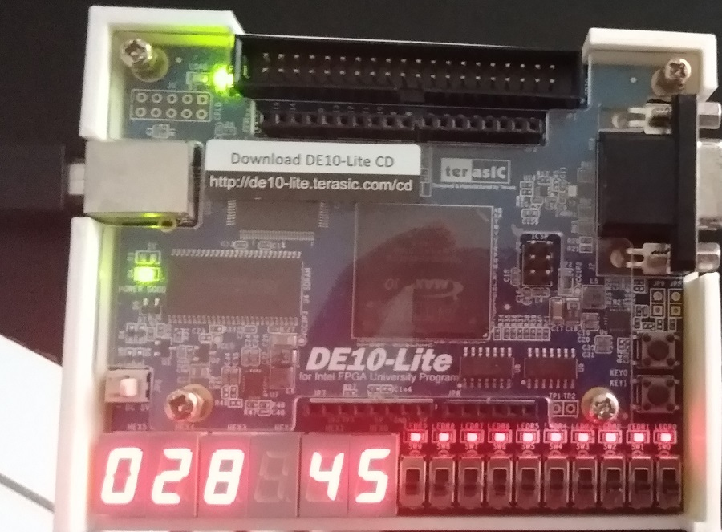

# Projeto 1 - Simulação da ALU da CPU RISC-V       
 - Projeto para testar a ALU da CPU RISC-V no kit FPGA DE10-Lite.       
 - Instruções testadas:       
	- **`add`**/**`addi`**.     
	- **`sub`**.     
	- **`and`**/**`andi`**.     
	- **`or`**/**`ori`**.     
	- **`xor`**/**`xori`**.     
	- **`sll`**/**`slli`**.     
	- **`srl`**/**`srli`**.     
	- **`slt`**/**`slti`**.     
	- **`sltu`**/**`sltui`**.     
	- **`sra`**/**`srai`**.     
	- **`lui`**.     
	- **`mul`**.     
	- **`mulh`**.     
	- **`mulhsu`**.     
	- **`mulhu`**.     
	- **`div`**.     
	- **`divu`**.     
	- **`rem`**.     
	- **`remu`**.     
 - Sobre o funcionamento:    
	- Os valores referentes aos dois operandos de entrada são, respectivamente, 23 e 3.   
	- O conjunto de _switches_ 0 a 5 é usado para definir o código as instruçãoe xecutada na ALU.     
	- Uma vez definido um código válido em `SW[4:0]`, será apresentado o resultado da operação nos displays de 7 segmentos do kit FPGA.        
	  

# Imagem: Programa em funcionamento no kit FPGA Terasic DE10-Lite:       
       
        

# Vídeo com o programa desse projeto em funcionamento:     
       
        
         
[Vídeo: Teste das funções da ALU](./Docs_Resultados/Vid03_TesteALU.mp4)       
          