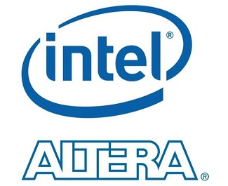
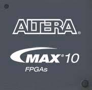
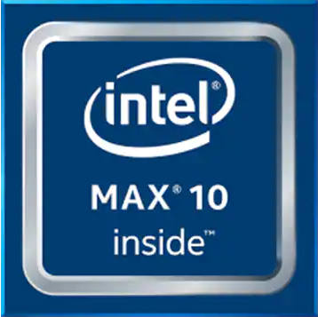

# TCC em Sistemas Embarcados - Eduardo Alvim        
|    |    |
| :---: | :---: |
|  |  |
|  |  |
|  |  |
        
 - Arquivos referentes ao projeto da monografia do aluno Eduardo Alvm Guedes Alcoforado.      
 - Faculdade de Tecnologia SENAI "Ancieta".     
 - Curso de **Pós-Graduação em Sistemas Embarcados** - Turma 6 - **6SE**.      
 - Sobre os projetos disponíveis nesse repositório:       
	- Linguagens utilizadas: **Verilog** e **SystemVerilog**.      
	- Projetos gerados usando a ferramenta Intel **Quartus Prime 20.1.1 - Lite Edition**.      
	- Os projetos desse repositório foram desenvolvidos para serem implementados em CIs FPGA da família Max 10 da Altera/Intel).      
	- Os projetos aqui foram testados em um kit FPGA **Terasic DE10-Lite**.     
	- Esse kit contém o CI FPGA **10M50DAF484C7G**.        
 - Compilação dos **scripts em Assembly RISC-V**:    
	- Compilados usando o compilador e simulador **RARS**.       
	- O RARS é uma ferramenta gratuita e pode ser baixado [aqui](https://github.com/TheThirdOne/rars/releases).     
          

# Pastas com os projetos:      
 - Pasta **`Proj_RV32I_01_ALU_RISC-V`**:       
	- Implementação básica da ALU (_Arithmetic Logic Unit_) da CPU RISC-V.     
	- Os testes das instruçõesx processadas na ALU são realizados de forma manual (ver o vídeo).       
 - Pasta **`Proj_RV32IM_02_De10Lite`**:     
	- Implementação da CPU RISC-V com o conjunto de instruções **RV32IM**.     
	- O código não está 100%, mas todo o conteúdo prioritário está pronto e fiuncionando.      
 - Pasta **`Scripts_asm`**:     
	- Scripts em Assembly RISC-V com programas usados para testar os projeto que cria uma CPU RISC-V.         
	 
